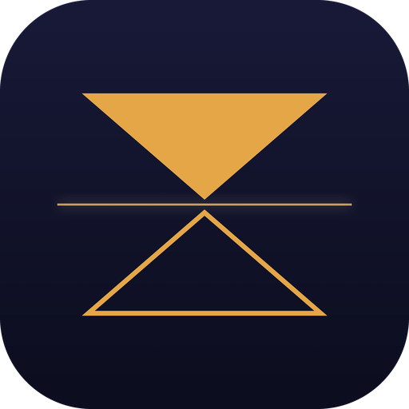
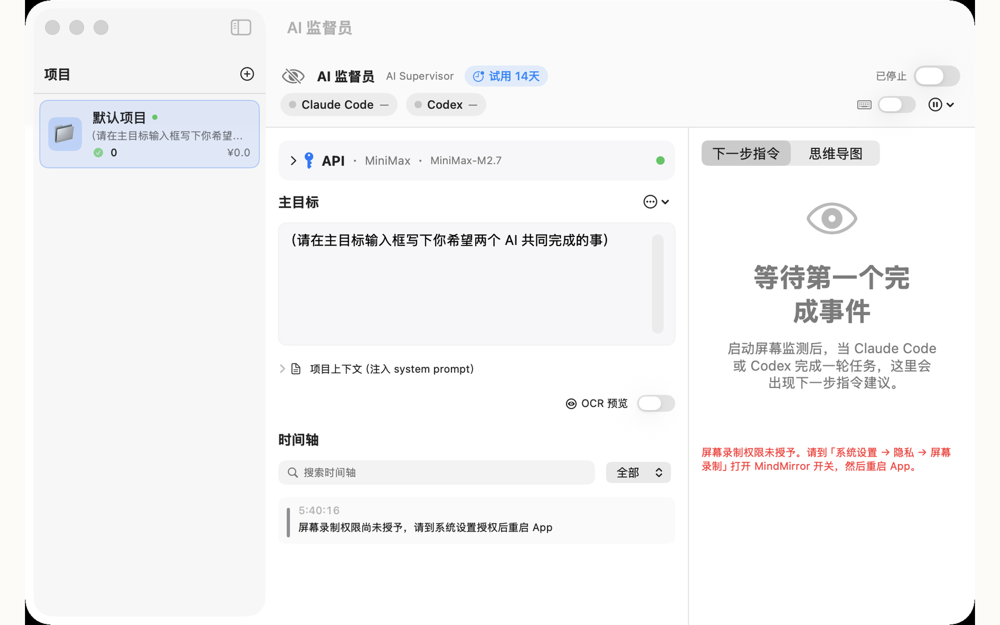
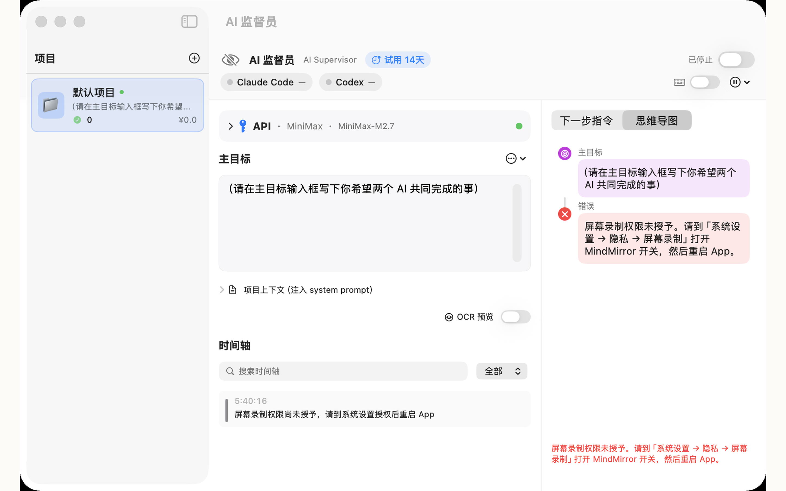
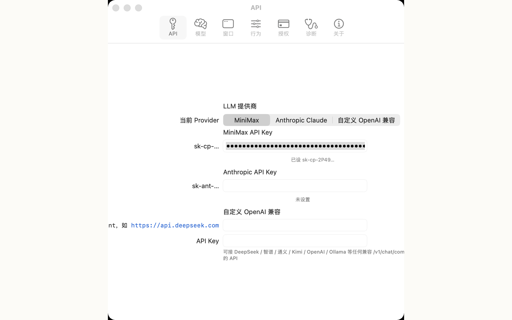
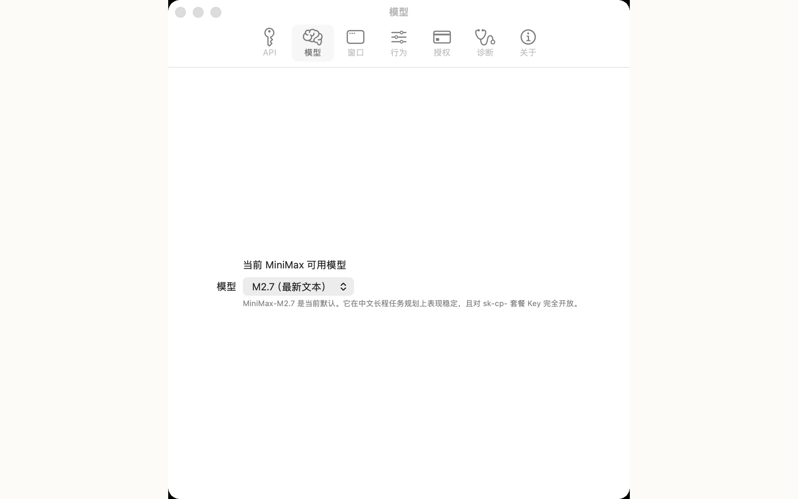
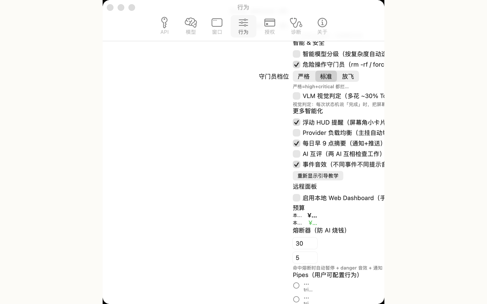

<div align="center">



# MindMirror

**AI 监督员 — 让两个 AI 互相监督，专注创造**

[](#license)
[](#-系统要求)
[](https://apps.apple.com/app/id6770338370)
[](https://hxx.lemonsqueezy.com)
[](https://mindmirror-5ns.pages.dev)
[](PRIVACY.md)

</div>

---

当你同时使用 **Claude Code、Codex、Cursor、Cline** 等多个 AI 编程助手，MindMirror 在屏幕上观察它们的工作过程，自动识别每一轮任务完成的时机，调用大语言模型分析当前进展，生成下一步指令——并自动键入到 AI 窗口。

**核心使命**：让你专注做创造性工作，把"想下一步"这件事交给 AI。

🌐 **完整介绍**：[mindmirror-5ns.pages.dev](https://mindmirror-5ns.pages.dev)

## 📸 界面预览

<p align="center">
  
</p>

<details>
<summary><b>更多截图</b>（思维导图 / 设置面板 / 模型选择 / 行为开关 / 关于）</summary>

<br>

|  |  |
|---|---|
| **思维导图** — 完成事件树状回看 | **API 设置** — 3 个 LLM provider |
|  |  |
| **模型选择** — MiniMax M2.7 等 | **行为开关** — 静音/守门/HUD 等 |
|  |  |

</details>

## ✨ 主要功能

- 🖥️ **屏幕监督** — 截屏 OCR + AX 树双感知，识别 AI 完成事件
- 🧠 **智能规划** — MiniMax / Anthropic Claude / 自定义 OpenAI 兼容 LLM 生成下一步
- ⚡ **多步预案** — 一次输出 3-5 步，不必每步等待规划
- 📊 **项目管理** — 多项目独立目标、上下文、月预算
- 🛡️ **安全守护** — 22 种危险命令模式拦截（rm -rf 等）
- 🪟 **可视化** — 思维导图 + 时间轴 + 完成事件截图回看
- 🌐 **Web Dashboard** — 浏览器/手机 PWA 远程查看
- 🔌 **Hermes MCP** — 接入 [Nous Research Hermes Agent](https://hermes-agent.nousresearch.com/) 用自然语言控制

## 📦 两个版本

| | Lite（Mac App Store） | **Pro** |
|---|---|---|
| 价格 | 免费 | **¥130**（一次性买断 + 终身更新） |
| 屏幕监督 | ✅ | ✅ |
| 多 LLM 后端 | ✅ | ✅ |
| 多步预案 | ✅ | ✅ |
| 项目管理 | ✅ | ✅ |
| 危险命令守门 | ✅ | ✅ |
| 思维导图 + 时间轴 | ✅ | ✅ |
| **AutoTyper 自动键入** | ❌（剪贴板） | ✅ |
| **Claude Code Stop Hook** | ❌ | ✅ |
| **Hermes Agent MCP 桥** | ❌ | ✅ |
| **Git 跟踪 + autoStash** | ❌ | ✅ |
| **自动跑 xcodebuild/swift build** | ❌ | ✅ |
| **FileWatcher 监听项目** | ❌ | ✅ |
| **iOS dogfood VLM 视觉判定** | ❌ | ✅ |

## 🛒 购买

- **Lite 免费**：[Mac App Store](https://apps.apple.com/app/id6770338370)（审核中）
- **Pro ¥130**（约 $19 USD）：[hxx.lemonsqueezy.com](https://hxx.lemonsqueezy.com)（License key 终身有效，3 设备激活，所有未来更新免费，14 天无理由退款）

## ⚡ 快速开始

```bash
# 1. 下载 Pro .dmg（购买后邮件收到）
open ~/Downloads/MindMirror-Pro-*.dmg

# 2. 拖到 /Applications/
# 3. 首次启动会引导授予权限：
#    - 屏幕录制（截屏 OCR 用）
#    - Accessibility（AX 树读取 + 自动键入用）

# 4. Onboarding 5 步引导：
#    a. 配置 LLM API Key（MiniMax / Anthropic / 自定义 OpenAI）
#    b. 开启屏幕录制权限
#    c. 写下你的主目标（如"重构 ~/Desktop/myapp 为 SwiftUI 6"）
#    d. 输入 license key（购买后邮件收到）
#    e. 在 Project 设置里绑定 Claude Code / Codex 窗口

# 5. 挂机离开。回来看时间轴 + 思维导图。
```

## 💻 系统要求

- macOS 14.0+（Sonoma 或更新）
- Apple Silicon 或 Intel Mac
- 屏幕录制权限 + Accessibility 权限
- 至少一个 LLM API Key（MiniMax / Anthropic / 自定义 OpenAI 兼容）

## 🔐 隐私

所有屏幕识别在**本地完成**：

- 截图 + OCR 不上传任何远端服务器
- 仅向你**选定的 LLM** 发送 OCR 摘要 + 项目上下文
- API Key 存于 macOS Keychain（系统加密）
- 完整隐私政策见 [PRIVACY.md](PRIVACY.md)

## 🤝 集成

MindMirror Pro 是 [Hermes Agent](https://hermes-agent.nousresearch.com/) 生态的 specialist tool：在 Hermes 里用自然语言说"暂停监督员 60 分钟"、"把主目标改成 X"即可远程控制 MindMirror。未来计划支持 Claude Desktop、Cursor、Cline 等所有 MCP host。

## 🐛 反馈

- 提 [Issue](https://github.com/BB20260410/mindmirror/issues)
- 邮件：ilifelahepeq54@gmail.com
- 退款（14 天无理由）：[Lemon Squeezy 客户中心](https://hxx.lemonsqueezy.com) 或邮件

## 🗺️ 路线图

**v0.5（规划中）**
- 通用 MCP server（Claude Desktop / Cursor / Cline 都能接入）
- 支持 N 个 AI 面板（不限 Claude + Codex）
- TestFlight 一键发版（archive + altool + Submit 自动化）
- devicectl 真机日志 stream + crash 自动抓取
- Apple Intelligence on-device LLM（减云端依赖）

**v0.4（已发布）**
- iOS dogfood 链路（xcodebuild + simctl + VLM 视觉判定）
- PerceptionMode 路由（auto / AX-only / OCR-only）
- LLMNetworkRetry 统一重试 + Planner JSON 鲁棒化
- CrashLogScanner + workingDirectory hints + sandbox 警告

## 📄 License

MindMirror（Lite + Pro）为**专有软件**。完整许可条款见 [LICENSE](LICENSE)。

本仓库**不含源代码**，仅作 landing page、隐私政策、issue 跟踪。Pro 用户拿到的是已签名公证的 .dmg + license key，所有逻辑在客户端运行。

---

<div align="center">
<sub>Made with ❤️ in China · © 2026 BB20260410</sub>
</div>
